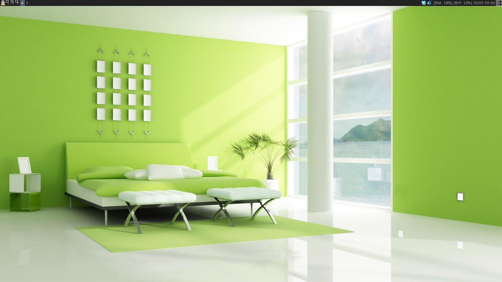

awesomecfg
==========

Mi configuración de Awesome Window Manager.

Es una configuración bastante senzilla, pero la intención es tener una copia de seguridad de mi configuración.
La tengo personalizada a mi gusto.

Mi versión de awesome, es **v.3.5.1**

Instalación
-----------

Si ya tenemos una configuración previa, hacer antes un backup.
- ``cd ~/.config/``
- ``mv awesome awesome.back``

En el terminal:
- ``cd ~/.config/``
- ``git clone https://github.com/francescarpi/awesomecfg.git awesome``

Luego modificar la variable **carpeta_tema** del fichero **theme.lua** del tema **cesc** modificando
vuestro path de usuario.

¡Reiniciar awesime y listo!

Nuevas funcionalidades
----------------------

- Widget que muestra el estado de la batería. Se actualiza al hacer clic encima
- Widget de brillo. Subiendo o bajando la rueda del ratón encima, podemos subir o bajar el brillo de la pantalla. 
- Widget de volumen. Subiendo o bajando la rueda del ratón encima del widget, sube o baja el volumen. Con el botón derecho se pasa de mute a sonido.
- "Mod4 + a" encima de una ventana con el foco, la trae hacia delante.
- Widget que indica el nombre de la wifi conectada

Capturas de pantalla
--------------------

